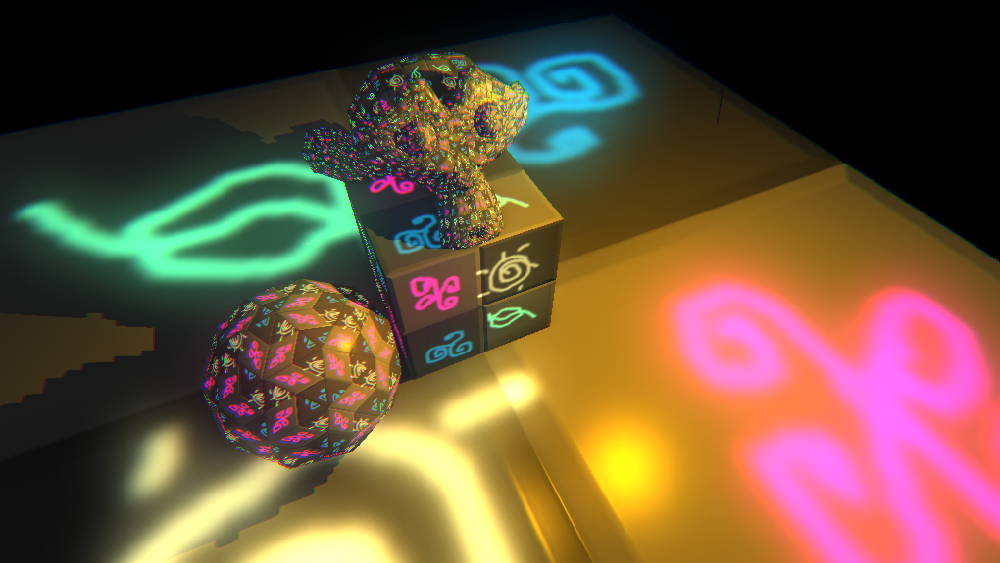

# Push3d
Read as "pushed", is a revamp of [PushEd](https://marketplace.yoyogames.com/assets/676/pushed-level-editor) for GameMaker Studio 2, now focusing on 3D.

Maintained by: [kraifpatrik](https://github.com/kraifpatrik)
Donate: [PayPal.Me](https://www.paypal.me/kraifpatrik/1usd)

# Latest Screenshot


# Table of Contents
- [Reference](#reference) 
	- [p3d_assert](#p3d_assert)
	- [p3d_assert_ds_exists](#p3d_assert_ds_exists)
	- [p3d_assert_equal](#p3d_assert_equal)
	- [p3d_assert_not_equal](#p3d_assert_not_equal)
	- [p3d_color_alpha_to_argb](#p3d_color_alpha_to_argb)
	- [p3d_color_argb_to_alpha](#p3d_color_argb_to_alpha)
	- [p3d_color_from_argb](#p3d_color_from_argb)
	- [p3d_color_rgb_to_bgr](#p3d_color_rgb_to_bgr)
	- [p3d_cubemap_create](#p3d_cubemap_create)
	- [p3d_cubemap_free_surfaces](#p3d_cubemap_free_surfaces)
	- [p3d_cubemap_get_projection_matrix](#p3d_cubemap_get_projection_matrix)
	- [p3d_cubemap_get_surface](#p3d_cubemap_get_surface)
	- [p3d_cubemap_get_view_matrix](#p3d_cubemap_get_view_matrix)
	- [p3d_cubemap_to_single_surface](#p3d_cubemap_to_single_surface)
	- [p3d_draw_rectangle](#p3d_draw_rectangle)
	- [p3d_ds_list_add_list](#p3d_ds_list_add_list)
	- [p3d_ds_list_add_map](#p3d_ds_list_add_map)
	- [p3d_ds_list_add_unique](#p3d_ds_list_add_unique)
	- [p3d_ds_list_insert_list](#p3d_ds_list_insert_list)
	- [p3d_ds_list_insert_map](#p3d_ds_list_insert_map)
	- [p3d_ds_list_insert_unique](#p3d_ds_list_insert_unique)
	- [p3d_gui_add_event_action](#p3d_gui_add_event_action)
	- [p3d_gui_add_widget](#p3d_gui_add_widget)
	- [p3d_gui_button](#p3d_gui_button)
	- [p3d_gui_checkbox](#p3d_gui_checkbox)
	- [p3d_gui_container](#p3d_gui_container)
	- [p3d_gui_create](#p3d_gui_create)
	- [p3d_gui_destroy](#p3d_gui_destroy)
	- [p3d_gui_destroy_event](#p3d_gui_destroy_event)
	- [p3d_gui_draw](#p3d_gui_draw)
	- [p3d_gui_draw_button](#p3d_gui_draw_button)
	- [p3d_gui_draw_checkbox](#p3d_gui_draw_checkbox)
	- [p3d_gui_draw_container](#p3d_gui_draw_container)
	- [p3d_gui_draw_hscrollbar](#p3d_gui_draw_hscrollbar)
	- [p3d_gui_draw_hscrollbar_thumb](#p3d_gui_draw_hscrollbar_thumb)
	- [p3d_gui_draw_hslider](#p3d_gui_draw_hslider)
	- [p3d_gui_draw_hslider_thumb](#p3d_gui_draw_hslider_thumb)
	- [p3d_gui_draw_vscrollbar](#p3d_gui_draw_vscrollbar)
	- [p3d_gui_draw_vscrollbar_thumb](#p3d_gui_draw_vscrollbar_thumb)
	- [p3d_gui_event](#p3d_gui_event)
	- [p3d_gui_event_change](#p3d_gui_event_change)
	- [p3d_gui_event_click](#p3d_gui_event_click)
	- [p3d_gui_event_drag](#p3d_gui_event_drag)
	- [p3d_gui_event_dragend](#p3d_gui_event_dragend)
	- [p3d_gui_event_dragstart](#p3d_gui_event_dragstart)
	- [p3d_gui_event_keydown](#p3d_gui_event_keydown)
	- [p3d_gui_event_keypress](#p3d_gui_event_keypress)
	- [p3d_gui_event_keyup](#p3d_gui_event_keyup)
	- [p3d_gui_event_mousedown](#p3d_gui_event_mousedown)
	- [p3d_gui_event_mouseenter](#p3d_gui_event_mouseenter)
	- [p3d_gui_event_mouseleave](#p3d_gui_event_mouseleave)
	- [p3d_gui_event_mousemove](#p3d_gui_event_mousemove)
	- [p3d_gui_event_mousepress](#p3d_gui_event_mousepress)
	- [p3d_gui_event_mouseup](#p3d_gui_event_mouseup)
	- [p3d_gui_event_mousewheel](#p3d_gui_event_mousewheel)
	- [p3d_gui_event_redraw](#p3d_gui_event_redraw)
	- [p3d_gui_event_scroll](#p3d_gui_event_scroll)
	- [p3d_gui_find_widget](#p3d_gui_find_widget)
	- [p3d_gui_get_event](#p3d_gui_get_event)
	- [p3d_gui_get_event_target_name](#p3d_gui_get_event_target_name)
	- [p3d_gui_has_event](#p3d_gui_has_event)
	- [p3d_gui_hscrollbar](#p3d_gui_hscrollbar)
	- [p3d_gui_hscrollbar_thumb](#p3d_gui_hscrollbar_thumb)
	- [p3d_gui_hslider](#p3d_gui_hslider)
	- [p3d_gui_hslider_thumb](#p3d_gui_hslider_thumb)
	- [p3d_gui_onclick_checkbox](#p3d_gui_onclick_checkbox)
	- [p3d_gui_ondrag_hscrollbar_thumb](#p3d_gui_ondrag_hscrollbar_thumb)
	- [p3d_gui_ondrag_hslider_thumb](#p3d_gui_ondrag_hslider_thumb)
	- [p3d_gui_ondrag_vscrollbar_thumb](#p3d_gui_ondrag_vscrollbar_thumb)
	- [p3d_gui_ondragstart_hscrollbar_thumb](#p3d_gui_ondragstart_hscrollbar_thumb)
	- [p3d_gui_ondragstart_hslider_thumb](#p3d_gui_ondragstart_hslider_thumb)
	- [p3d_gui_ondragstart_vscrollbar_thumb](#p3d_gui_ondragstart_vscrollbar_thumb)
	- [p3d_gui_onredraw_container](#p3d_gui_onredraw_container)
	- [p3d_gui_set_position](#p3d_gui_set_position)
	- [p3d_gui_set_rectangle](#p3d_gui_set_rectangle)
	- [p3d_gui_trigger_event](#p3d_gui_trigger_event)
	- [p3d_gui_trigger_event_list](#p3d_gui_trigger_event_list)
	- [p3d_gui_vscrollbar](#p3d_gui_vscrollbar)
	- [p3d_gui_vscrollbar_thumb](#p3d_gui_vscrollbar_thumb)
	- [p3d_hammersley_2d](#p3d_hammersley_2d)
	- [p3d_matrix_add_componentwise](#p3d_matrix_add_componentwise)
	- [p3d_matrix_build_lookat](#p3d_matrix_build_lookat)
	- [p3d_matrix_clone](#p3d_matrix_clone)
	- [p3d_matrix_create](#p3d_matrix_create)
	- [p3d_matrix_create_from_columns](#p3d_matrix_create_from_columns)
	- [p3d_matrix_create_from_rows](#p3d_matrix_create_from_rows)
	- [p3d_matrix_determinant](#p3d_matrix_determinant)
	- [p3d_matrix_inverse](#p3d_matrix_inverse)
	- [p3d_matrix_multiply_componentwise](#p3d_matrix_multiply_componentwise)
	- [p3d_matrix_scale](#p3d_matrix_scale)
	- [p3d_matrix_subtract_componentwise](#p3d_matrix_subtract_componentwise)
	- [p3d_matrix_to_euler](#p3d_matrix_to_euler)
	- [p3d_matrix_transpose](#p3d_matrix_transpose)
	- [p3d_mesh_create](#p3d_mesh_create)
	- [p3d_mesh_destroy](#p3d_mesh_destroy)
	- [p3d_mesh_init](#p3d_mesh_init)
	- [p3d_mesh_load_json](#p3d_mesh_load_json)
	- [p3d_mesh_load_obj](#p3d_mesh_load_obj)
	- [p3d_mesh_recalculate_tbn](#p3d_mesh_recalculate_tbn)
	- [p3d_mesh_save_json](#p3d_mesh_save_json)
	- [p3d_mesh_to_vbuffer](#p3d_mesh_to_vbuffer)
	- [p3d_quaternion_add](#p3d_quaternion_add)
	- [p3d_quaternion_clone](#p3d_quaternion_clone)
	- [p3d_quaternion_conjugate](#p3d_quaternion_conjugate)
	- [p3d_quaternion_create](#p3d_quaternion_create)
	- [p3d_quaternion_create_from_axisangle](#p3d_quaternion_create_from_axisangle)
	- [p3d_quaternion_create_fromto_rotation](#p3d_quaternion_create_fromto_rotation)
	- [p3d_quaternion_create_identity](#p3d_quaternion_create_identity)
	- [p3d_quaternion_create_look_rotation](#p3d_quaternion_create_look_rotation)
	- [p3d_quaternion_dot](#p3d_quaternion_dot)
	- [p3d_quaternion_inverse](#p3d_quaternion_inverse)
	- [p3d_quaternion_length](#p3d_quaternion_length)
	- [p3d_quaternion_lengthsqr](#p3d_quaternion_lengthsqr)
	- [p3d_quaternion_lerp](#p3d_quaternion_lerp)
	- [p3d_quaternion_multiply](#p3d_quaternion_multiply)
	- [p3d_quaternion_normalize](#p3d_quaternion_normalize)
	- [p3d_quaternion_rotate](#p3d_quaternion_rotate)
	- [p3d_quaternion_scale](#p3d_quaternion_scale)
	- [p3d_quaternion_subtract](#p3d_quaternion_subtract)
	- [p3d_quaternion_to_angle](#p3d_quaternion_to_angle)
	- [p3d_quaternion_to_axis](#p3d_quaternion_to_axis)
	- [p3d_quaternion_to_matrix](#p3d_quaternion_to_matrix)
	- [p3d_smoothstep](#p3d_smoothstep)
	- [p3d_ssao_create_kernel](#p3d_ssao_create_kernel)
	- [p3d_ssao_draw](#p3d_ssao_draw)
	- [p3d_ssao_free](#p3d_ssao_free)
	- [p3d_ssao_init](#p3d_ssao_init)
	- [p3d_ssao_make_noise_surface](#p3d_ssao_make_noise_surface)
	- [p3d_string_explode](#p3d_string_explode)
	- [p3d_string_join](#p3d_string_join)
	- [p3d_string_join_array](#p3d_string_join_array)
	- [p3d_string_join_list](#p3d_string_join_list)
	- [p3d_string_remove_part](#p3d_string_remove_part)
	- [p3d_string_split_on_first](#p3d_string_split_on_first)
	- [p3d_string_trim](#p3d_string_trim)
	- [p3d_surface_blur](#p3d_surface_blur)
	- [p3d_surface_check](#p3d_surface_check)
	- [p3d_surface_create_from_sprite](#p3d_surface_create_from_sprite)
	- [p3d_vec2_abs](#p3d_vec2_abs)
	- [p3d_vec2_add](#p3d_vec2_add)
	- [p3d_vec2_ceil](#p3d_vec2_ceil)
	- [p3d_vec2_clamp_length](#p3d_vec2_clamp_length)
	- [p3d_vec2_clone](#p3d_vec2_clone)
	- [p3d_vec2_create](#p3d_vec2_create)
	- [p3d_vec2_create_barycentric](#p3d_vec2_create_barycentric)
	- [p3d_vec2_dot](#p3d_vec2_dot)
	- [p3d_vec2_equals](#p3d_vec2_equals)
	- [p3d_vec2_floor](#p3d_vec2_floor)
	- [p3d_vec2_frac](#p3d_vec2_frac)
	- [p3d_vec2_length](#p3d_vec2_length)
	- [p3d_vec2_lengthsqr](#p3d_vec2_lengthsqr)
	- [p3d_vec2_lerp](#p3d_vec2_lerp)
	- [p3d_vec2_max_component](#p3d_vec2_max_component)
	- [p3d_vec2_maximize](#p3d_vec2_maximize)
	- [p3d_vec2_min_component](#p3d_vec2_min_component)
	- [p3d_vec2_minimize](#p3d_vec2_minimize)
	- [p3d_vec2_multiply](#p3d_vec2_multiply)
	- [p3d_vec2_normalize](#p3d_vec2_normalize)
	- [p3d_vec2_reflect](#p3d_vec2_reflect)
	- [p3d_vec2_scale](#p3d_vec2_scale)
	- [p3d_vec2_subtract](#p3d_vec2_subtract)
	- [p3d_vec2_transform](#p3d_vec2_transform)
	- [p3d_vec3_abs](#p3d_vec3_abs)
	- [p3d_vec3_add](#p3d_vec3_add)
	- [p3d_vec3_ceil](#p3d_vec3_ceil)
	- [p3d_vec3_clamp_length](#p3d_vec3_clamp_length)
	- [p3d_vec3_clone](#p3d_vec3_clone)
	- [p3d_vec3_create](#p3d_vec3_create)
	- [p3d_vec3_create_barycentric](#p3d_vec3_create_barycentric)
	- [p3d_vec3_cross](#p3d_vec3_cross)
	- [p3d_vec3_dot](#p3d_vec3_dot)
	- [p3d_vec3_equals](#p3d_vec3_equals)
	- [p3d_vec3_floor](#p3d_vec3_floor)
	- [p3d_vec3_frac](#p3d_vec3_frac)
	- [p3d_vec3_length](#p3d_vec3_length)
	- [p3d_vec3_lengthsqr](#p3d_vec3_lengthsqr)
	- [p3d_vec3_lerp](#p3d_vec3_lerp)
	- [p3d_vec3_max_component](#p3d_vec3_max_component)
	- [p3d_vec3_maximize](#p3d_vec3_maximize)
	- [p3d_vec3_min_component](#p3d_vec3_min_component)
	- [p3d_vec3_minimize](#p3d_vec3_minimize)
	- [p3d_vec3_multiply](#p3d_vec3_multiply)
	- [p3d_vec3_normalize](#p3d_vec3_normalize)
	- [p3d_vec3_orthonormalize](#p3d_vec3_orthonormalize)
	- [p3d_vec3_project](#p3d_vec3_project)
	- [p3d_vec3_reflect](#p3d_vec3_reflect)
	- [p3d_vec3_scale](#p3d_vec3_scale)
	- [p3d_vec3_slerp](#p3d_vec3_slerp)
	- [p3d_vec3_subtract](#p3d_vec3_subtract)
	- [p3d_vec3_transform](#p3d_vec3_transform)
	- [p3d_vec3_unproject](#p3d_vec3_unproject)
	- [p3d_vec4_abs](#p3d_vec4_abs)
	- [p3d_vec4_add](#p3d_vec4_add)
	- [p3d_vec4_ceil](#p3d_vec4_ceil)
	- [p3d_vec4_clamp_length](#p3d_vec4_clamp_length)
	- [p3d_vec4_clone](#p3d_vec4_clone)
	- [p3d_vec4_create](#p3d_vec4_create)
	- [p3d_vec4_create_barycentric](#p3d_vec4_create_barycentric)
	- [p3d_vec4_dot](#p3d_vec4_dot)
	- [p3d_vec4_equals](#p3d_vec4_equals)
	- [p3d_vec4_floor](#p3d_vec4_floor)
	- [p3d_vec4_frac](#p3d_vec4_frac)
	- [p3d_vec4_length](#p3d_vec4_length)
	- [p3d_vec4_lengthsqr](#p3d_vec4_lengthsqr)
	- [p3d_vec4_lerp](#p3d_vec4_lerp)
	- [p3d_vec4_max_component](#p3d_vec4_max_component)
	- [p3d_vec4_maximize](#p3d_vec4_maximize)
	- [p3d_vec4_min_component](#p3d_vec4_min_component)
	- [p3d_vec4_minimize](#p3d_vec4_minimize)
	- [p3d_vec4_multiply](#p3d_vec4_multiply)
	- [p3d_vec4_normalize](#p3d_vec4_normalize)
	- [p3d_vec4_scale](#p3d_vec4_scale)
	- [p3d_vec4_subtract](#p3d_vec4_subtract)
	- [p3d_vec4_transform](#p3d_vec4_transform)
	- [p3d_xml_element_add_child](#p3d_xml_element_add_child)
	- [p3d_xml_element_create](#p3d_xml_element_create)
	- [p3d_xml_element_destroy](#p3d_xml_element_destroy)
	- [p3d_xml_element_find](#p3d_xml_element_find)
	- [p3d_xml_element_find_all](#p3d_xml_element_find_all)
	- [p3d_xml_element_find_first_attribute](#p3d_xml_element_find_first_attribute)
	- [p3d_xml_element_find_next_attribute](#p3d_xml_element_find_next_attribute)
	- [p3d_xml_element_get_attribute](#p3d_xml_element_get_attribute)
	- [p3d_xml_element_get_attribute_count](#p3d_xml_element_get_attribute_count)
	- [p3d_xml_element_get_child](#p3d_xml_element_get_child)
	- [p3d_xml_element_get_child_count](#p3d_xml_element_get_child_count)
	- [p3d_xml_element_get_name](#p3d_xml_element_get_name)
	- [p3d_xml_element_get_parent](#p3d_xml_element_get_parent)
	- [p3d_xml_element_get_value](#p3d_xml_element_get_value)
	- [p3d_xml_element_has_attribute](#p3d_xml_element_has_attribute)
	- [p3d_xml_element_has_value](#p3d_xml_element_has_value)
	- [p3d_xml_element_remove_attribute](#p3d_xml_element_remove_attribute)
	- [p3d_xml_element_set_attribute](#p3d_xml_element_set_attribute)
	- [p3d_xml_element_set_name](#p3d_xml_element_set_name)
	- [p3d_xml_element_set_value](#p3d_xml_element_set_value)
	- [p3d_xml_parse](#p3d_xml_parse)
	- [p3d_xml_read](#p3d_xml_read)
	- [p3d_xml_string](#p3d_xml_string)
	- [p3d_xml_write](#p3d_xml_write)

# Reference
## p3d\_assert
```
p3d_assert(exp, msg)
```
Shows the error message if the expression is not a `real` (`bool`) or equals to `0` (`false`) and aborts the game.

### Arguments:
Name | Type | Description
---- | ---- | -----------
exp | `any` | The expression to assert.
msg | `string` | The error message.

## p3d\_assert\_ds\_exists
```
p3d_assert_ds_exists(id, type, msg)
```
Checks if the ds of given id and type exists. If it does not, then aborts the game, showing the error message.

### Arguments:
Name | Type | Description
---- | ---- | -----------
id | `real` | The id of the ds.
type | `real` | The ds type (`ds_type_map`, `ds_type_list`, ...).
msg | `string` | The error message.

### Example:
```
var _map = ds_map_create();
p3d_assert_ds_exists(_map, ds_type_map,
    "This should pass, since we just created it.");
ds_map_destroy(_map);
p3d_assert_ds_exists(_map, ds_type_map,
    "This will abort the game just as expected.");
```

## p3d\_assert\_equal
```
p3d_assert_equal(exp, val, msg)
```
Shows the error message if the expression is not equal to `val`.

### Arguments:
Name | Type | Description
---- | ---- | -----------
exp | `any` | The expression to assert.
val | `any` | The expected value.
msg | `string` | The error message.

## p3d\_assert\_not\_equal
```
p3d_assert_not_equal(exp, val, msg)
```
Shows the error message if the expression is equal to `val`.

### Arguments:
Name | Type | Description
---- | ---- | -----------
exp | `any` | The expression to assert.
val | `any` | The expected value.
msg | `string` | The error message.

## p3d\_color\_alpha\_to\_argb
```
p3d_color_alpha_to_argb(color, alpha)
```
Converts the color and aplha into a ARGB color.

### Arguments:
Name | Type | Description
---- | ---- | -----------
color | `real` | The color.
alpha | `real` | The alpha.

### Returns:
`real`: The ARGB color.

## p3d\_color\_argb\_to\_alpha
```
p3d_color_argb_to_alpha(argb)
```
Converts ARGB color to alpha.

### Arguments:
Name | Type | Description
---- | ---- | -----------
argb | `real` | The ARGB color.

### Returns:
`real`: The alpha.

## p3d\_color\_from\_argb
```
p3d_color_from_argb(argb)
```
Converts ARGB color to BGR color.

### Arguments:
Name | Type | Description
---- | ---- | -----------
argb | `real` | The ARGB color.

### Returns:
`real`: The BGR color.

## p3d\_color\_rgb\_to\_bgr
```
p3d_color_rgb_to_bgr(color)
```
Converts between RGB and BGR color format.

### Arguments:
Name | Type | Description
---- | ---- | -----------
color | `real` | The BGR or RGB color.

### Returns:
`real`: The resulting color.

## p3d\_cubemap\_create
```
p3d_cubemap_create(resolution)
```
Creates an empty cubemap, where each side is a separate surface.

### Arguments:
Name | Type | Description
---- | ---- | -----------
resolution | `real` | Size of one cube side.

### Returns:
`array`: An array representing the cubemap.

## p3d\_cubemap\_free\_surfaces
```
p3d_cubemap_free_surfaces(cubemap)
```
Frees surfaces used by the cubemap from memory.

### Arguments:
Name | Type | Description
---- | ---- | -----------
cubemap | `array` | The cubemap.

## p3d\_cubemap\_get\_projection\_matrix
```
p3d_cubemap_get_projection_matrix(znear, zfar)
```
Creates a projection matrix for the cubemap.

### Arguments:
Name | Type | Description
---- | ---- | -----------
znear | `real` | Distance to the near clipping plane of the projection.
zfar | `real` | Distance to the far clipping plane of the projection.

### Returns:
`array`: The projection matrix.

## p3d\_cubemap\_get\_surface
```
p3d_cubemap_get_surface(cubemap, side)
```
Gets a surface for given cubemap side. If the surface is corrupted, then a new one is created.

### Arguments:
Name | Type | Description
---- | ---- | -----------
cubemap | `array` | The cubemap.
side | `real` | The cubemap side.

### Returns:
`real`: The surface.

## p3d\_cubemap\_get\_view\_matrix
```
p3d_cubemap_get_view_matrix(side, position)
```
Creates a view matrix for given cubemap side.

### Arguments:
Name | Type | Description
---- | ---- | -----------
side | `real` | The cubemap side.
position | `array` | The center position of the cubemap in the world space (vec3).

### Returns:
`array`: The created view matrix.

## p3d\_cubemap\_to\_single\_surface
```
p3d_cubemap_to_single_surface(cubemap, surface)
```
Puts all faces of the cubemap into a single surface.

### Arguments:
Name | Type | Description
---- | ---- | -----------
cubemap | `array` | The cubemap.
surface | `real` | The target surface (recreated or resized if necessary).

### Returns:
`real`: The target surface.

## p3d\_draw\_rectangle
```
p3d_draw_rectangle(x, y, width, height, color[, alpha])
```
Draws a rectangle of the given size and color at the given position.

### Arguments:
Name | Type | Description
---- | ---- | -----------
x | `real` | The x position to draw the rectangle at.
y | `real` | The y position to draw the rectangle at.
width | `real` | The width of the rectangle.
height | `real` | The height of the rectangle.
color | `real` | The color of the rectangle.
alpha | `real` | The alpha of the rectangle.

## p3d\_ds\_list\_add\_list
```
p3d_ds_list_add_list(l1, l2)
```
Adds the list l2 into the list l1.

### Arguments:
Name | Type | Description
---- | ---- | -----------
l1 | `real` | The list to add into.
l2 | `real` | The list to be added.

## p3d\_ds\_list\_add\_map
```
p3d_ds_list_add_map(list, map)
```
Adds the map into the list.

### Arguments:
Name | Type | Description
---- | ---- | -----------
list | `real` | The list to add into.
map | `real` | The map to be added.

## p3d\_ds\_list\_add\_unique
```
p3d_ds_list_add_unique(list, value)
```
If the value is not in the list, it is added to it.

### Arguments:
Name | Type | Description
---- | ---- | -----------
list | `real` | The id of the list.
value | `any` | The value to be added.

### Returns:
`real`: The index on which has been the value found or -1.

## p3d\_ds\_list\_insert\_list
```
p3d_ds_list_insert_list(l1, pos, l2)
```
Inserts the list l2 into the list l1 at the given position.

### Arguments:
Name | Type | Description
---- | ---- | -----------
l1 | `real` | The list to inserted into.
pos | `real` | The index to insert the list at.
l2 | `real` | The list to be inserted.

## p3d\_ds\_list\_insert\_map
```
p3d_ds_list_insert_map(list, pos, map)
```
Inserts the map into the list at the given position.

### Arguments:
Name | Type | Description
---- | ---- | -----------
list | `real` | The list to inserted into.
pos | `real` | The index to insert the list at.
map | `real` | The map to be inserted.

## p3d\_ds\_list\_insert\_unique
```
p3d_ds_list_insert_unique(list, value, position)
```
If the value is not in the list, it is inserted to it at given position.

### Arguments:
Name | Type | Description
---- | ---- | -----------
list | `real` | The id of the list.
value | `any` | The value to be added.
position | `real` | The index to insert the value at.

### Returns:
`real`: The index on which has been the value found or -1.

## p3d\_gui\_add\_event\_action
```
p3d_gui_add_event_action(widget, event, action)
```
Adds an event action to the widget. This action will then be executed every time the widgets receives an event of given type.

### Arguments:
Name | Type | Description
---- | ---- | -----------
widget | `real` | The widget to add the action to.
event | `string` | The name of the event on which the action should be executed.
action | `real` | A script (the action) that will be executed. Must take two arguments, where the first one will be the widget that received the event and the second one will be the event itself.

### Returns:
`real`: The widget.

## p3d\_gui\_add\_widget
```
p3d_gui_add_widget(widgetSet, widget)
```
Adds the widget to the widget set.

### Arguments:
Name | Type | Description
---- | ---- | -----------
widgetSet | `real` | The widget set to add the widget to.
widget | `real` | The widget to be added.

### Returns:
`real`: The widget set.

## p3d\_gui\_button
```
p3d_gui_button(text)
```
Creates a new button.

### Arguments:
Name | Type | Description
---- | ---- | -----------
text | `string` | The text on the button.

### Returns:
`real`: The created button.

## p3d\_gui\_checkbox
```
p3d_gui_checkbox(checked)
```
Creates a new checkbox.

### Arguments:
Name | Type | Description
---- | ---- | -----------
checked | `bool` | True to set it's default state to "checked".

### Returns:
`real`: The created checkbox.

## p3d\_gui\_container
```
p3d_gui_container()
```
Creates a new container.

### Returns:
`real`: The created container.

## p3d\_gui\_create
```
p3d_gui_create()
```
Creates a new GUI system.

### Returns:
`real`: The created GUI system.

## p3d\_gui\_destroy
```
p3d_gui_destroy(gui)
```
Destroys the GUI system.

### Arguments:
Name | Type | Description
---- | ---- | -----------
gui | `real` | The GUI system to be destroyed.

## p3d\_gui\_destroy\_event
```
p3d_gui_destroy_event(event)
```
Destroys the event.

### Arguments:
Name | Type | Description
---- | ---- | -----------
event | `real` | The event to be destroyed.

## p3d\_gui\_draw
```
p3d_gui_draw(gui)
```
Draws the GUI system.

### Arguments:
Name | Type | Description
---- | ---- | -----------
gui | `real` | The GUI system to be drawed.

### Note:
This also handles the GUI logic!

## p3d\_gui\_draw\_button
```
p3d_gui_draw_button(button)
```
Draws the button.

### Arguments:
Name | Type | Description
---- | ---- | -----------
button | `real` | The button to draw.

## p3d\_gui\_draw\_checkbox
```
p3d_gui_draw_checkbox(checkbox)
```
Draws the checkox.

### Arguments:
Name | Type | Description
---- | ---- | -----------
checkbox | `real` | The checkbox to draw.

## p3d\_gui\_draw\_container
```
p3d_gui_draw_container(container)
```
Draws the container.

### Arguments:
Name | Type | Description
---- | ---- | -----------
container | `real` | The container to draw.

## p3d\_gui\_draw\_hscrollbar
```
p3d_gui_draw_hscrollbar(hScrollbar)
```
Draws the horizontal scrollbar.

### Arguments:
Name | Type | Description
---- | ---- | -----------
hScrollbar | `real` | The horizontal scrollbar to draw.

## p3d\_gui\_draw\_hscrollbar\_thumb
```
p3d_gui_draw_hscrollbar_thumb(hScrollbarThumb)
```
Draws the horizontal scrollbar thumb.

### Arguments:
Name | Type | Description
---- | ---- | -----------
hScrollbarThumb | `real` | The horizontal scrollbar thumb to draw.

## p3d\_gui\_draw\_hslider
```
p3d_gui_draw_hslider(hSlider)
```
Draws the horizontal slider.

### Arguments:
Name | Type | Description
---- | ---- | -----------
hScrollbar | `real` | The horizontal slider to draw.

## p3d\_gui\_draw\_hslider\_thumb
```
p3d_gui_draw_hslider_thumb(hSliderThumb)
```
Draws the horizontal slider thumb.

### Arguments:
Name | Type | Description
---- | ---- | -----------
hSliderThumb | `real` | The horizontal slider thumb to draw.

## p3d\_gui\_draw\_vscrollbar
```
p3d_gui_draw_vscrollbar(vScrollbar)
```
Draws the vertical scrollbar.

### Arguments:
Name | Type | Description
---- | ---- | -----------
hScrollbar | `real` | The vertical scrollbar to draw.

## p3d\_gui\_draw\_vscrollbar\_thumb
```
p3d_gui_draw_vscrollbar_thumb(vScrollbarThumb)
```
Draws the vertical scrollbar thumb.

### Arguments:
Name | Type | Description
---- | ---- | -----------
vScrollbarThumb | `real` | The vertical scrollbar thumb to draw.

## p3d\_gui\_event
```
p3d_gui_event(type)
```
Creates a new event of given type.

### Arguments:
Name | Type | Description
---- | ---- | -----------
type | `string` | The event type.

### Returns:
`real`: The created event.

## p3d\_gui\_event\_change
```
p3d_gui_event_change(valPrev, valueNew)
```
Creates a new "change" event.

### Arguments:
Name | Type | Description
---- | ---- | -----------
valPrev | `any` | The previous value of the property that has changed.
valueNew | `any` | The new value of the property that has changed.

### Returns:
`real`: The created event.

## p3d\_gui\_event\_click
```
p3d_gui_event_click(alt, ctrl, shift)
```
Creates a new "click" event.

### Arguments:
Name | Type | Description
---- | ---- | -----------
alt | `bool` | True if the alt key was held during the click.
ctrl | `bool` | True if the ctrl key was held during the click.
shift | `bool` | True if the shift key was held during the click.

### Returns:
`real`: The created event.

## p3d\_gui\_event\_drag
```
p3d_gui_event_drag(x, y)
```
Creates a new "drag" event.

### Arguments:
Name | Type | Description
---- | ---- | -----------
x | `real` | The new x position.
y | `real` | The new y position.

### Returns:
`real`: The created event.

## p3d\_gui\_event\_dragend
```
p3d_gui_event_dragend(x, y)
```
Creates a new "dragend" event.

### Arguments:
Name | Type | Description
---- | ---- | -----------
x | `real` | The final x position.
y | `real` | The final y position.

### Returns:
`real`: The created event.

## p3d\_gui\_event\_dragstart
```
p3d_gui_event_dragstart(x, y)
```
Creates a new "dragstart" event.

### Arguments:
Name | Type | Description
---- | ---- | -----------
x | `real` | The starting x position.
y | `real` | The starting y position.

### Returns:
`real`: The created event.

## p3d\_gui\_event\_keydown
```
p3d_gui_event_keydown(key, alt, ctrl, shift)
```
Creates a new "keydown" event.

### Arguments:
Name | Type | Description
---- | ---- | -----------
key | `real` | The key that is down.
alt | `bool` | True if the alt key is down.
ctrl | `bool` | True if the ctrl key is down.
shift | `bool` | True if the shift key is down.

### Returns:
`real`: The created event.

## p3d\_gui\_event\_keypress
```
p3d_gui_event_keypress(key, alt, ctrl, shift)
```
Creates a new "keypress" event.

### Arguments:
Name | Type | Description
---- | ---- | -----------
key | `real` | The key that was pressed.
alt | `bool` | True if the alt key was held during the key press.
ctrl | `bool` | True if the ctrl key was held during the key press.
shift | `bool` | True if the shift key was held during the key press.

### Returns:
`real`: The created event.

## p3d\_gui\_event\_keyup
```
p3d_gui_event_keyup(key, alt, ctrl, shift)
```
Creates a new "keyup" event.

### Arguments:
Name | Type | Description
---- | ---- | -----------
key | `real` | The key that was released.
alt | `bool` | True if the alt key was held during the key release.
ctrl | `bool` | True if the ctrl key was held during the key release.
shift | `bool` | True if the shift key was held during the key release.

### Returns:
`real`: The created event.

## p3d\_gui\_event\_mousedown
```
p3d_gui_event_mousedown(button, alt, ctrl, shift)
```
Creates a new "mousedown" event.

### Arguments:
Name | Type | Description
---- | ---- | -----------
button | `real` | The mouse button that is down.
alt | `bool` | True if the alt key is down.
ctrl | `bool` | True if the ctrl key is down.
shift | `bool` | True if the shift key is down.

### Returns:
`real`: The created event.

## p3d\_gui\_event\_mouseenter
```
p3d_gui_event_mouseenter()
```
Creates a new "mouseenter" event.

### Returns:
`real`: The created event.

## p3d\_gui\_event\_mouseleave
```
p3d_gui_event_mouseleave()
```
Creates a new "mouseleave" event.

### Returns:
`real`: The created event.

## p3d\_gui\_event\_mousemove
```
p3d_gui_event_mousemove(button, x, y, prevX, prevY, alt, ctrl, shift)
```
Creates a new "mousemove" event.

### Arguments:
Name | Type | Description
---- | ---- | -----------
button | `real` | The mouse button that was down during the mouse movement.
x | `real` | The new mouse x position.
y | `real` | The new mouse y position.
prevX | `real` | The previous mouse x position.
prevY | `real` | The previous mouse y position.
alt | `bool` | True if the alt key was held during the mouse movement.
ctrl | `bool` | True if the ctrl key was held during the mouse movement.
shift | `bool` | True if the shift key was held during the mouse movement.

### Returns:
`real`: The created event.

## p3d\_gui\_event\_mousepress
```
p3d_gui_event_mousepress(button, alt, ctrl, shift)
```
Creates a new "mousepress" event.

### Arguments:
Name | Type | Description
---- | ---- | -----------
button | `real` | The mouse button that was pressed.
alt | `bool` | True if the alt key was held during the mouse button press.
ctrl | `bool` | True if the ctrl key was held during the mouse button press.
shift | `bool` | True if the shift key was held during the mouse button press.

### Returns:
`real`: The created event.

## p3d\_gui\_event\_mouseup
```
p3d_gui_event_mouseup(button, alt, ctrl, shift)
```
Creates a new "mouseup" event.

### Arguments:
Name | Type | Description
---- | ---- | -----------
button | `real` | The mouse button that was released.
alt | `bool` | True if the alt key was held during the mouse button release.
ctrl | `bool` | True if the ctrl key was held during the mouse button release.
shift | `bool` | True if the shift key was held during the mouse button release.

### Returns:
`real`: The created event.

## p3d\_gui\_event\_mousewheel
```
p3d_gui_event_mousewheel(wheel, alt, ctrl, shift)
```
Creates a new "mousewheel" event.

### Arguments:
Name | Type | Description
---- | ---- | -----------
wheel | `real` | The mouse wheel scrolling direction (`-1` is up, `1` is down).
alt | `bool` | True if the alt key was held during the mouse wheel scroll.
ctrl | `bool` | True if the ctrl key was held during the mouse wheel scroll.
shift | `bool` | True if the shift key was held during the mouse wheel scroll.

### Returns:
`real`: The created event.

## p3d\_gui\_event\_redraw
```
p3d_gui_event_redraw()
```
Creates a new "redraw" event.

### Returns:
`real`: The created event.

## p3d\_gui\_event\_scroll
```
p3d_gui_event_scroll()
```
Creates a new "scroll" event.

### Returns:
`real`: The created event.

## p3d\_gui\_find\_widget
```
p3d_gui_find_widget(widgetSet, name)
```
Recursively finds a widget of given name within the widget set.

### Arguments:
Name | Type | Description
---- | ---- | -----------
widgetSet | `real` | The widget set to search within.
name | `string` | The name of the widget to be found.

### Returns:
`real`: The found widget or the constant `noone` if no widget was found.

## p3d\_gui\_get\_event
```
p3d_gui_get_event(gui)
```
Gets an event that occurred within the GUI system.

### Arguments:
Name | Type | Description
---- | ---- | -----------
gui | `real` | The GUI system to get an event from.

### Returns:
`real`: The event.

### Note:
All events retrieved with this function must be destroyed when you're done using them!

### See Also:
[p3d_gui_has_event](#p3d-_gui-_has-_event), [p3d_gui_destroy_event](#p3d-_gui-_destroy-_event)

## p3d\_gui\_get\_event\_target\_name
```
p3d_gui_get_event_target_name(event)
```
Gets the name of the event's target widget.

### Returns:
`string`: The name of the event's target widget.

## p3d\_gui\_has\_event
```
p3d_gui_has_event(gui)
```
Checks whether some events occurred within the GUI system.

### Arguments:
Name | Type | Description
---- | ---- | -----------
gui | `real` | The GUI system.

### Returns:
`bool`: True if there are some event.

### See Also:
[p3d_gui_het_event](#p3d-_gui-_het-_event)

## p3d\_gui\_hscrollbar
```
p3d_gui_hscrollbar()
```
Creates a new horizontal scrollbar.

### Returns:
`real`: The created horizontal scrollbar.

## p3d\_gui\_hscrollbar\_thumb
```
p3d_gui_hscrollbar_thumb()
```
Creates a new horizontal scrollbar thumb.

### Returns:
`real`: The created horizontal scrollbar thumb.

## p3d\_gui\_hslider
```
p3d_gui_hslider(valueMin, valueMax)
```
Creates a new horizontal slider.

### Arguments:
Name | Type | Description
---- | ---- | -----------
valueMin | `real` | The minimal value of the slider.
valueMax | `real` | The maxmimum value of the slider.

### Returns:
`real`: The created horizontal slider.

## p3d\_gui\_hslider\_thumb
```
p3d_gui_hslider_thumb()
```
Creates a new horizontal slider thumb.

### Returns:
`real`: The created horizontal slider thumb.

## p3d\_gui\_onclick\_checkbox
```
p3d_gui_onclick_checkbox(checkbox, event)
```
Defines how checkbox handles a "click" event.

### Arguments:
Name | Type | Description
---- | ---- | -----------
checkbox | `real` | The checkbox.
event | `real` | The event to handle.

## p3d\_gui\_ondrag\_hscrollbar\_thumb
```
p3d_gui_ondrag_hscrollbar_thumb(hScrollbarThumb, event)
```
Defines how horizontal scrollbar thumb handles a "drag" event.

### Arguments:
Name | Type | Description
---- | ---- | -----------
hScrollbarThumb | `real` | The horizontal scrollbar thumb.
event | `real` | The event to handle.

## p3d\_gui\_ondrag\_hslider\_thumb
```
p3d_gui_ondrag_hslider_thumb(hSliderThumb, event)
```
Defines how horizontal slider thumb handles a "drag" event.

### Arguments:
Name | Type | Description
---- | ---- | -----------
hSliderThumb | `real` | The horizontal slider thumb.
event | `real` | The event to handle.

## p3d\_gui\_ondrag\_vscrollbar\_thumb
```
p3d_gui_ondrag_vscrollbar_thumb(vScrollbarThumb, event)
```
Defines how vertical scrollbar thumb handles a "drag" event.

### Arguments:
Name | Type | Description
---- | ---- | -----------
vScrollbarThumb | `real` | The vertical scrollbar thumb.
event | `real` | The event to handle.

## p3d\_gui\_ondragstart\_hscrollbar\_thumb
```
p3d_gui_ondragstart_hscrollbar_thumb(hScrollbarThumb, event)
```
Defines how horizontal scrollbar thumb handles a "dragstart" event.

### Arguments:
Name | Type | Description
---- | ---- | -----------
hScrollbarThumb | `real` | The horizontal scrollbar thumb.
event | `real` | The event to handle.

## p3d\_gui\_ondragstart\_hslider\_thumb
```
p3d_gui_ondragstart_hslider_thumb(hSliderThumb, event)
```
Defines how horizontal slider thumb handles a "dragstart" event.

### Arguments:
Name | Type | Description
---- | ---- | -----------
hSliderThumb | `real` | The horizontal slider thumb.
event | `real` | The event to handle.

## p3d\_gui\_ondragstart\_vscrollbar\_thumb
```
p3d_gui_ondragstart_vscrollbar_thumb(vScrollbarThumb, event)
```
Defines how vertical scrollbar thumb handles a "dragstart" event.

### Arguments:
Name | Type | Description
---- | ---- | -----------
vScrollbarThumb | `real` | The vertical scrollbar thumb.
event | `real` | The event to handle.

## p3d\_gui\_onredraw\_container
```
p3d_gui_onredraw_container(container, event)
```
Defines how container handles a "redraw" event.

### Arguments:
Name | Type | Description
---- | ---- | -----------
container | `real` | The container.
event | `real` | The event to handle.

## p3d\_gui\_set\_position
```
p3d_gui_set_position(widget, x, y)
```
Sets the position of the widget.

### Arguments:
Name | Type | Description
---- | ---- | -----------
widget | `real` | The widget.
x | `real` | The new x position of the widget.
y | `real` | The new y position of the widget.

### Returns:
`real`: The widget.

## p3d\_gui\_set\_rectangle
```
p3d_gui_set_rectangle(widget, x, y, width, height)
```
Sets the position and size of the widget.

### Arguments:
Name | Type | Description
---- | ---- | -----------
widget | `real` | The widget.
x | `real` | The new x position of the widget.
y | `real` | The new y position of the widget.
width | `real` | The new width of the widget.
height | `real` | The new height of the widget.

### Returns:
`real`: The widget.

## p3d\_gui\_trigger\_event
```
p3d_gui_trigger_event(widget, event, ...)
```
Triggers given events in the widget. Events which have property "bubble" set to `true` are then triggered in the widget's delegate until they reach the GUI system object.

### Arguments:
Name | Type | Description
---- | ---- | -----------
widget | `real` | The widget.
event | `real` | The event to be triggered.

### Note:
Events that do not bubble are destroyed automatically, but the rest you must destroy by hand!

### See Also:
[p3d_gui_trigger_event_ist](#p3d-_gui-_trigger-_event-_ist), [p3d_gui_has_event](#p3d-_gui-_has-_event), [p3d_gui_get_event](#p3d-_gui-_get-_event), [p3d_gui_destroy_event](#p3d-_gui-_destroy-_event)

## p3d\_gui\_trigger\_event\_list
```
p3d_gui_trigger_event_list(widget, events)
```
Triggers given events in the widget. Events which have property "bubble" set to `true` are then triggered in the widget's delegate until they reach the GUI system object.

### Arguments:
Name | Type | Description
---- | ---- | -----------
widget | `real` | The widget.
events | `real` | The list of events to be triggered.

### Note:
Events that do not bubble are destroyed automatically, but the rest you must destroy by hand! Also the passed list of events is not deleted by this script and therefore it's up to you as well.

### See Also:
[p3d_gui_trigger_event](#p3d-_gui-_trigger-_event), [p3d_gui_has_event](#p3d-_gui-_has-_event), [p3d_gui_get_event](#p3d-_gui-_get-_event), [p3d_gui_destroy_event](#p3d-_gui-_destroy-_event)

## p3d\_gui\_vscrollbar
```
p3d_gui_vscrollbar()
```
Creates a new vertical scrollbar.

### Returns:
`real`: The created vertical scrollbar.

## p3d\_gui\_vscrollbar\_thumb
```
p3d_gui_vscrollbar_thumb()
```
Creates a new vertical scrollbar thumb.

### Returns:
`real`: The created vertical scrollbar thumb.

## p3d\_hammersley\_2d
```
p3d_hammersley_2d(i, n)
```
Gets i-th point from sequence of uniformly distributed points on a unit square.

### Arguments:
Name | Type | Description
---- | ---- | -----------
i | `real` | The point index in sequence.
n | `real` | The total size of the sequence.

### Source:
http://holger.dammertz.org/stuff/notes_HammersleyOnHemisphere.html

## p3d\_matrix\_add\_componentwise
```
p3d_matrix_add_componentwise(m1, m2)
```
Adds matrices `m1`, `m2` componentwise and stores the result to `m1`.

### Arguments:
Name | Type | Description
---- | ---- | -----------
m1 | `array` | The first matrix.
m2 | `array` | The second matrix.

## p3d\_matrix\_build\_lookat
```
p3d_matrix_build_lookat(from, to, up)
```
Builds a look-at matrix from given vec3.

### Arguments:
Name | Type | Description
---- | ---- | -----------
from | `array` | Camera's position vector.
to | `array` | Camera's target position.
up | `array` | Camera's up vector.

### Returns:
`array`: The created matrix.

## p3d\_matrix\_clone
```
p3d_matrix_clone(m)
```
Creates a clone of the matrix.

### Arguments:
Name | Type | Description
---- | ---- | -----------
m | `array` | The matrix to create a clone of.

### Returns:
`array`: The created matrix.

## p3d\_matrix\_create
```
p3d_matrix_create(m00, m01, m02, m03, m10, m11, m12, m13, m20, m21, m22, m23, m30, m31, m32, m33)
```
Creates a matrix with given components.

### Arguments:
Name | Type | Description
---- | ---- | -----------
m00..m03 | `real` | The first row of the matrix.
m10..m13 | `real` | The second row of the matrix.
m20..m23 | `real` | The third row of the matrix.
m30..m33 | `real` | The fourth row of the matrix.

### Returns:
`array`: The created matrix.

## p3d\_matrix\_create\_from\_columns
```
p3d_matrix_create_from_columns(c0, c1, c2, c3)
```
Creates a matrix with specified columns.

### Arguments:
Name | Type | Description
---- | ---- | -----------
c0 | `array` | The first column of the matrix.
c1 | `array` | The second column of the matrix.
c2 | `array` | The third column of the matrix.
c3 | `array` | The fourth column of the matrix.

### Returns:
`array`: The created matrix.

## p3d\_matrix\_create\_from\_rows
```
p3d_matrix_create_from_rows(r0, r1, r2, r3)
```
Creates a matrix with specified rows.

### Arguments:
Name | Type | Description
---- | ---- | -----------
r0 | `array` | The first row of the matrix.
r1 | `array` | The second row of the matrix.
r2 | `array` | The third row of the matrix.
r3 | `array` | The fourth row of the matrix.

### Returns:
`array`: The created matrix.

## p3d\_matrix\_determinant
```
p3d_matrix_determinant(m)
```
Gets the determinant of the matrix.

### Arguments:
Name | Type | Description
---- | ---- | -----------
m | `array` | The matrix.

### Returns:
`real`: The determinant of the matrix.

## p3d\_matrix\_inverse
```
p3d_matrix_inverse(m)
```
Inverts the matrix.

### Arguments:
Name | Type | Description
---- | ---- | -----------
m | `array` | The matrix.

## p3d\_matrix\_multiply\_componentwise
```
p3d_matrix_multiply_componentwise(m1, m2)
```
Multiplies matrices `m1`, `m2` componentwise and stores the result to `m1`.

### Arguments:
Name | Type | Description
---- | ---- | -----------
m1 | `array` | The first matrix.
m2 | `array` | The second matrix.

## p3d\_matrix\_scale
```
p3d_matrix_scale(m, s)
```
Scales the matrix by the value.

### Arguments:
Name | Type | Description
---- | ---- | -----------
m | `array` | The matrix to scale.
s | `real` | The value to scale the matrix by.

## p3d\_matrix\_subtract\_componentwise
```
p3d_matrix_subtract_componentwise(m1, m2)
```
Subtracts matrices `m1`, `m2` componentwise and stores the result to `m1`.

### Arguments:
Name | Type | Description
---- | ---- | -----------
m1 | `array` | The first matrix.
m2 | `array` | The second matrix.

## p3d\_matrix\_to\_euler
```
p3d_matrix_to_euler(m)
```
Gets euler angles from the YXZ rotation matrix.

### Arguments:
Name | Type | Description
---- | ---- | -----------
m | `array` | The YXZ rotation matrix.

### Returns:
`array`: An array containing the euler angles `[rotX, rotY, rotZ]`.

### Source:
https://www.geometrictools.com/Documentation/EulerAngles.pdf

## p3d\_matrix\_transpose
```
p3d_matrix_transpose(m)
```
Transposes the matrix.

### Arguments:
Name | Type | Description
---- | ---- | -----------
m | `array` | The matrix to be transposed.

## p3d\_mesh\_create
```
p3d_mesh_create()
```
Creates an empty mesh.

### Returns:
`real`: The id of the ds_map containing mesh data.

## p3d\_mesh\_destroy
```
p3d_mesh_destroy(mesh)
```
Destroys the mesh.

### Arguments:
Name | Type | Description
---- | ---- | -----------
mesh | `real` | The id of the mesh.

## p3d\_mesh\_init
```
p3d_mesh_init()
```
Initializes mesh functionality.

## p3d\_mesh\_load\_json
```
p3d_mesh_load_json(file)
```
Loads a mesh from a JSON formatted file.

### Arguments:
Name | Type | Description
---- | ---- | -----------
file | `string` | The file to load the mesh from.

### Returns:
`real`: The id of the mesh on success or `noone` on fail.

## p3d\_mesh\_load\_obj
```
p3d_mesh_load_obj(file)
```
Loads a 3D mesh data into a ds_map from the *.obj file.

### Arguments:
Name | Type | Description
---- | ---- | -----------
file | `string` | The path to the file.

### Returns:
`real`: The id of the mesh on success or `noone` on fail.

## p3d\_mesh\_recalculate\_tbn
```
p3d_mesh_recalculate_tbn(mesh)
```
Recalculates tangent vectors and bitangent sign for the mesh.

### Arguments:
Name | Type | Description
---- | ---- | -----------
mesh | `real` | The id of the mesh.

### Returns:
`bool`: True on success.

### Source:
http://www.opengl-tutorial.org/intermediate-tutorials/tutorial-13-normal-mapping/

## p3d\_mesh\_save\_json
```
p3d_mesh_save_json(mesh, file)
```
Saves the mesh into a JSON formatted file.

### Arguments:
Name | Type | Description
---- | ---- | -----------
mesh | `real` | The id of the mesh.
file | `string` | The file to save the mesh to.

### Returns:
`bool`: True on success.

## p3d\_mesh\_to\_vbuffer
```
p3d_mesh_to_vbuffer(mesh, format)
```
Creates a vertex buffer from the mesh.

### Arguments:
Name | Type | Description
---- | ---- | -----------
mesh | `real` | The id of the mesh.
format | `real` | The vertex buffer format.

### Returns:
`real`: The id of the vertex buffer on success or `noone` on fail.

## p3d\_quaternion\_add
```
p3d_quaternion_add(q1, q2)
```
Adds the quaternions `q1`, `q2` and stores the result to `q1`.

### Arguments:
Name | Type | Description
---- | ---- | -----------
q1 | `array` | The first quaternion.
q2 | `array` | The second quaternion.

## p3d\_quaternion\_clone
```
p3d_quaternion_clone(v)
```
Creates a clone of the quaternion.

### Arguments:
Name | Type | Description
---- | ---- | -----------
v | `array` | The quaternion.

### Returns:
`array`: The created quaternion.

## p3d\_quaternion\_conjugate
```
p3d_quaternion_conjugate(q)
```
Conjugates the quaternion.

### Arguments:
Name | Type | Description
---- | ---- | -----------
q | `array` | The quaternion.

## p3d\_quaternion\_create
```
p3d_quaternion_create(x, y, z, w)
```
Creates a quaternion.

### Arguments:
Name | Type | Description
---- | ---- | -----------
x | `real` | The x component of the quaternion.
y | `real` | The y component of the quaternion.
z | `real` | The z component of the quaternion.
w | `real` | The w component of the quaternion.

### Returns:
`array`: The created quaternion.

## p3d\_quaternion\_create\_from\_axisangle
```
p3d_quaternion_create_from_axisangle(axis, angle)
```
Creates a quaternion form the axis an the angle.

### Arguments:
Name | Type | Description
---- | ---- | -----------
axis | `array` | A 3D vector representing the axis.
angle | `real` | The angle in degrees.

### Returns:
`array`: The created quaternion.

## p3d\_quaternion\_create\_fromto\_rotation
```
p3d_quaternion_create_fromto_rotation(from, to)
```
Creates a quaternion that represents rotation from one vector to another.

### Arguments:
Name | Type | Description
---- | ---- | -----------
from | `array` | The 3D "from" vector.
to | `array` | The 3D "to" vector.

### Returns:
`array`: The created quaternion.

## p3d\_quaternion\_create\_identity
```
p3d_quaternion_create_identity()
```
Creates an identity quaternion.

### Returns:
`array`: The created identity quaternion.

## p3d\_quaternion\_create\_look\_rotation
```
p3d_quaternion_create_look_rotation(forward, up)
```
Creates a quaternion with the specified forward and up vectors. These vectors must not be parallel! If they are, then an identity quaternion will be returned.

### Arguments:
Name | Type | Description
---- | ---- | -----------
forward | `array` | The 3D forward unit vector.
up | `array` | The 3D up unit vector.

### Returns:
`array`: An array representing the quaternion.

## p3d\_quaternion\_dot
```
p3d_quaternion_dot(q1, q2)
```
Gets the dot product of the two quaternions.

### Arguments:
Name | Type | Description
---- | ---- | -----------
q1 | `array` | The first quaternion.
q2 | `array` | The second quaternion.

### Returns:
`real`: The dot product of the two quaternions.

## p3d\_quaternion\_inverse
```
p3d_quaternion_inverse(q)
```
Inverts the quaternion.

### Arguments:
Name | Type | Description
---- | ---- | -----------
q | `array` | The quaternion.

## p3d\_quaternion\_length
```
p3d_quaternion_length(q)
```
Gets the length of the quaternion.

### Arguments:
Name | Type | Description
---- | ---- | -----------
q | `array` | The quaternion.

### Returns:
`real`: The length of the quaternion.

## p3d\_quaternion\_lengthsqr
```
p3d_quaternion_lengthsqr(q)
```
Gets the squared length of the quaternion.

### Arguments:
Name | Type | Description
---- | ---- | -----------
q | `array` | An array representing the quaternion.

### Returns:
`real`: The squared length of the quaternion.

## p3d\_quaternion\_lerp
```
p3d_quaternion_lerp(q1, q2, s)
```
Performs a linear interpolation between the quaternions `q1`, `q2` and stores the result to `q1`.

### Arguments:
Name | Type | Description
---- | ---- | -----------
q1 | `array` | The first quaternion.
q2 | `array` | The second quaternion.
s | `real` | The lerping factor.

## p3d\_quaternion\_multiply
```
p3d_quaternion_multiply(q1, q2)
```
Multiplies the quaternions `q1`, `q2` and stores the result to `q1`.

### Arguments:
Name | Type | Description
---- | ---- | -----------
q1 | `array` | The first quaternion.
q2 | `array` | The second quaternion.

## p3d\_quaternion\_normalize
```
p3d_quaternion_normalize(q)
```
Normalizes the quaternion.

### Arguments:
Name | Type | Description
---- | ---- | -----------
q | `array` | The quaternion.

## p3d\_quaternion\_rotate
```
p3d_quaternion_rotate(q, v)
```
Rotates the 3D vector by the quaternion.

### Arguments:
Name | Type | Description
---- | ---- | -----------
q | `array` | The quaternion.
v | `array` | The 3D vector.

## p3d\_quaternion\_scale
```
p3d_quaternion_scale(q, s)
```
Scales a quaternion by the value.

### Arguments:
Name | Type | Description
---- | ---- | -----------
q | `array` | The quaternion.
s | `real` | The value to scale the quaternion by.

## p3d\_quaternion\_subtract
```
p3d_quaternion_subtract(q1, q2)
```
Subtracts quaternion `q2` from `q1` and stores the result into `q1`.

### Arguments:
Name | Type | Description
---- | ---- | -----------
q1 | `array` | The quaternion to subtract from.
q2 | `array` | The quaternion to subtract.

## p3d\_quaternion\_to\_angle
```
p3d_quaternion_to_angle(q)
```
Gets quaternion angle in degrees.

### Arguments:
Name | Type | Description
---- | ---- | -----------
q | `array` | The quaternion.

### Returns:
`real`: The quaternion angle in degrees.

## p3d\_quaternion\_to\_axis
```
p3d_quaternion_to_axis(q)
```
Creates 3D axis from the quaternion.

### Arguments:
Name | Type | Description
---- | ---- | -----------
q | `array` | The quaternion.

### Returns:
`array`: The created axis as `[x, y, z]`.

## p3d\_quaternion\_to\_matrix
```
p3d_quaternion_to_matrix(q)
```
Creates a rotation matrix from the quaternion.

### Arguments:
Name | Type | Description
---- | ---- | -----------
q | `array` | The quaternion.

### Returns:
`array`: The created rotation matrix.

## p3d\_smoothstep
```
p3d_smoothstep(e0, e1, x)
```
Performs smooth Hermite interpolation between 0 and 1 when e0 < x < e1.

### Arguments:
Name | Type | Description
---- | ---- | -----------
e0 | `real` | The lower edge of the Hermite function.
e1 | `real` | The upper edge of the Hermite function.
x | `real` | The source value for interpolation.

### Returns:
`real`: The resulting interpolated value.

### Source:
https://www.khronos.org/registry/OpenGL-Refpages/gl4/html/smoothstep.xhtml

## p3d\_ssao\_create\_kernel
```
p3d_ssao_create_kernel(size)
```
Generates a kernel of random vectors to be used for the SSAO.

### Arguments:
Name | Type | Description
---- | ---- | -----------
size | `real` | Number of vectors in the kernel.

### Returns:
`array`: The created kernel as `[v1X, v1Y, v1Z, v2X, v2Y, v2Z, ...,///                 vnX, vnY, vnZ]`.

## p3d\_ssao\_draw
```
p3d_ssao_draw(surSsao, surWork, surDepth, surNormal, matView, matProj, clipFar)
```
Renders SSAO into the `surSsao` surface.

### Arguments:
Name | Type | Description
---- | ---- | -----------
surSsao | `real` | The surface to draw the SSAO to.
surWork | `real` | A working surface used for blurring the SSAO. Must have the same size as `surSsao`!
surDepth | `real` | A surface containing the scene depth.
surNormal | `real` | A surface containing the scene normals.
matView | `array` | The view matrix used when rendering the scene.
matProj | `array` | The projection matrix used when rendering the scene.
clipFar | `real` | A distance to the far clipping plane (same as in the projection used when rendering the scene).

## p3d\_ssao\_free
```
p3d_ssao_free()
```
Frees resources used by the SSAO from memory.

## p3d\_ssao\_init
```
p3d_ssao_init(radius, bias, power)
```
Initializes resources necessary for the SSAO funcionality.

### Arguments:
Name | Type | Description
---- | ---- | -----------
radius | `real` | Radius of the occlusion effect. Anything further than that won't add to occlusion.
bias | `real` | Depth bias to avoid too much self occlusion. Higher values mean lower self occlusion.
power | `real` | Strength of the occlusion effect. Should be greater than 0.

## p3d\_ssao\_make\_noise\_surface
```
p3d_ssao_make_noise_surface(size)
```
Creates a surface containing a random noise for the SSAO.

### Arguments:
Name | Type | Description
---- | ---- | -----------
size | `real` | Size of the noise surface.

### Returns:
`real`: The created noise surface.

## p3d\_string\_explode
```
p3d_string_explode(string, char)
```
Splits given string on every `char` and puts created parts into an array.

### Arguments:
Name | Type | Description
---- | ---- | -----------
string | `string` | The string to explode.
char | `string` | The character to split the string on.

### Returns:
`array`: The created array.

## p3d\_string\_join
```
p3d_string_join(string, values...)
```
Joins given values together putting the string between each consecutive two.

### Arguments:
Name | Type | Description
---- | ---- | -----------
string | `string` | The string to put between two consecutive values.
values | `any` | Any number of values to be joined.

### Returns:
`string`: The resulting string.

### Example:
```
show_debug_message(
  p3d_string_join(" ", "Player", player.name, "took", _damage, "damage!")
);
```
This could show a debug message saying "Player Patrik took 60 damage!".

## p3d\_string\_join\_array
```
p3d_string_join_array(string, array)
```
Joins values in the array putting the string between each two consecutive values.

### Arguments:
Name | Type | Description
---- | ---- | -----------
string | `string` | The string to put between two consecutive values.
array | `array` | An array of values that you want to join.

### Returns:
`string`: The resulting string.

### Example:
```
show_message("Numbers: " + p3d_string_join_array(", ", [1, 2, 3, 4]));
```
This will show a message saying "Numbers: 1, 2, 3, 4".

## p3d\_string\_join\_list
```
p3d_string_join_list(string, list)
```
Joins values in the list putting the string between each two consecutive values.

### Arguments:
Name | Type | Description
---- | ---- | -----------
string | `string` | The string to put between two consecutive values.
list | `real` | The id of the list of values that you want to join.

### Returns:
`string`: The resulting string.

### Example:
```
var _numbers = ds_list_create();
ds_list_add(_numbers, 1, 2, 3, 4);
show_message("Numbers: " + p3d_string_join_list(", ", _numbers));
```
This will show a message saying "Numbers: 1, 2, 3, 4".

## p3d\_string\_remove\_part
```
p3d_string_remove_part(string, startStr, endStr)
```
Removes part beginning with startStr and ending with endStr from the string.

### Arguments:
Name | Type | Description
---- | ---- | -----------
startStr | `string` | The start of the part to remove.
endStr | `string` | The end of the part to remove.
string | `string` | The string to remove the part from.

### Returns:
`string`: The string with the given part removed.

## p3d\_string\_split\_on\_first
```
p3d_string_split_on_first(string, delimiter)
```
Splits the string in two at the first occurence of the delimiter.

### Arguments:
Name | Type | Description
---- | ---- | -----------
string | `string` | The string to split.
delimiter | `string` | The delimiter.

### Returns:
`array`: An array containing [firstHalf, secondHalf]. If the delimiter is not found in the string, then secondHalf equals empty string and firstHalf is the original string.

## p3d\_string\_trim
```
p3d_string_trim(str)
```
Removes leading and trailing whitespace from the string.

### Arguments:
Name | Type | Description
---- | ---- | -----------
str | `string` | The string to remove the whitespace from.

### Returns:
`string`: The resulting string.

## p3d\_surface\_blur
```
p3d_surface_blur(target, work, scale)
```
Blurs the target surface.

### Arguments:
Name | Type | Description
---- | ---- | -----------
target | `real` | The id of the surface to be blurred.
work | `real` | The id of the working surface. Must have the same size as the target surface.
scale | `real` | The scale of the blur kernel.

## p3d\_surface\_check
```
p3d_surface_check(surface, width, height)
```
Checks whether the surface exists and if it has correct size. Broken surfaces are recreated. Surfaces of wrong size are resized.

### Arguments:
Name | Type | Description
---- | ---- | -----------
surface | `real` | The id of the surface.
width | `real` | The desired width of the surface.
height | `real` | The desired height of the surface.

### Returns:
`real`: The surface id.

## p3d\_surface\_create\_from\_sprite
```
p3d_surface_create_from_sprite(sprite, index)
```
Creates a surface from the sprite.

### Arguments:
Name | Type | Description
---- | ---- | -----------
sprite | `real` | The id of the sprite.
index | `real` | The sprite subimage index.

### Returns:
`real`: The created surface.

## p3d\_vec2\_abs
```
p3d_vec2_abs(v)
```
Sets vector's components to their absolute value.

### Arguments:
Name | Type | Description
---- | ---- | -----------
v | `array` | The vector.

## p3d\_vec2\_add
```
p3d_vec2_add(v1, v2)
```
Adds vectors `v1`, `v2` and stores the result into `v1`.

### Arguments:
Name | Type | Description
---- | ---- | -----------
v1 | `array` | The first vector.
v2 | `array` | The second vector.

## p3d\_vec2\_ceil
```
p3d_vec2_ceil(v)
```
Ceils each component of the vector.

### Arguments:
Name | Type | Description
---- | ---- | -----------
The | `array` | vector to ceil.

## p3d\_vec2\_clamp\_length
```
p3d_vec2_clamp_length(v, min, max)
```
Clamps vector's length between `min` and `max`.

### Arguments:
Name | Type | Description
---- | ---- | -----------
v | `array` | The vector.
min | `real` | The minimum vector length.
max | `real` | The maximum vector length.

## p3d\_vec2\_clone
```
p3d_vec2_clone(v)
```
Creates a clone of the vector.

### Arguments:
Name | Type | Description
---- | ---- | -----------
v | `array` | The vector.

### Returns:
`array`: The created clone.

## p3d\_vec2\_create
```
p3d_vec2_create(x[, y])
```
Creates a new vector with given components. If only the first value is supplied, then it is used for every component.

### Arguments:
Name | Type | Description
---- | ---- | -----------
x | `real` | The first vector component.
y | `real` | The second vector component.

### Returns:
`array`: The created vector.

### Note:
One could also just write `[x, y]`, which would give the same result.

## p3d\_vec2\_create\_barycentric
```
p3d_vec2_create_barycentric(v1, v2, v3, f, g)
```
Creates a new vector using barycentric coordinates, following formula `v1 + f(v2-v1) + g(v3-v1)`.

### Arguments:
Name | Type | Description
---- | ---- | -----------
v1 | `array` | The first point of triangle.
v2 | `array` | The second point of triangle.
v3 | `array` | The third point of triangle.
f | `real` | The first weighting factor.
g | `real` | The second weighting factor.

### Returns:
`array`: The created vector.

## p3d\_vec2\_dot
```
p3d_vec2_dot(v1, v2)
```
Gets the dot product of vectors `v1` and `v2`.

### Arguments:
Name | Type | Description
---- | ---- | -----------
v1 | `array` | The first vector.
v2 | `array` | The second vector.

### Returns:
`real`: The dot product.

## p3d\_vec2\_equals
```
p3d_vec2_equals(v1, v2)
```
Gets whether vectors `v1` and `v2` are equal.

### Arguments:
Name | Type | Description
---- | ---- | -----------
v1 | `array` | The first vector.
v2 | `array` | The second vector.

### Returns:
`bool`: True if the vectors are equal.

## p3d\_vec2\_floor
```
p3d_vec2_floor(v)
```
Floors each component of the vector.

### Arguments:
Name | Type | Description
---- | ---- | -----------
The | `array` | vector to floor.

## p3d\_vec2\_frac
```
p3d_vec2_frac(v)
```
Sets each component of the input vector to it's decimal part.

### Arguments:
Name | Type | Description
---- | ---- | -----------
v | `array` | The input vector.

## p3d\_vec2\_length
```
p3d_vec2_length(v)
```
Gets length of the vector.

### Arguments:
Name | Type | Description
---- | ---- | -----------
v | `array` | The vector.
The | `real` | vector's length.

## p3d\_vec2\_lengthsqr
```
p3d_vec2_lengthsqr(v)
```
Gets squared length of the vector.

### Arguments:
Name | Type | Description
---- | ---- | -----------
v | `array` | The vector.
The | `real` | vector's squared length.

## p3d\_vec2\_lerp
```
p3d_vec2_lerp(v1, v2, s)
```
Linearly interpolates between vectors `v1`, `v2` and stores the resulting vector into `v1`.

### Arguments:
Name | Type | Description
---- | ---- | -----------
v1 | `array` | The first vector.
v2 | `array` | The second vector.
s | `real` | The interpolation factor.

## p3d\_vec2\_max\_component
```
p3d_vec2_max_component(v)
```
Gets the largest component of the vector.

### Arguments:
Name | Type | Description
---- | ---- | -----------
v | `array` | The vector.

### Returns:
`real`: The vetor's largest component.

### Example:
Here the `_max` variable would be equal to `2`.
```
var _vec = [1, 2];
var _max = p3d_vec2_max_component(_vec);
```

## p3d\_vec2\_maximize
```
p3d_vec2_maximize(v1, v2)
```
Gets a vector that is made up of the largest components of the vectors `v1`, `v2` and stores it into `v1`.

### Arguments:
Name | Type | Description
---- | ---- | -----------
v1 | `array` | The first vector.
v2 | `array` | The second vector.

### Example:
This would make the vector `_v1` equal to `[2, 4]`.
```
var _v1 = [1, 4];
var _v2 = [2, 3];
p3d_vec2_maximize(_v1, _v2);
```

## p3d\_vec2\_min\_component
```
p3d_vec2_min_component(v)
```
Gets the smallest component of the vector.

### Arguments:
Name | Type | Description
---- | ---- | -----------
v | `array` | The vector.

### Returns:
`real`: The vetor's smallest component.

### Example:
Here the `_min` variable would be equal to `1`.
```
var _vec = [1, 2];
var _min = p3d_vec2_min_component(_vec);
```

## p3d\_vec2\_minimize
```
p3d_vec2_minimize(v1, v2)
```
Gets a vector that is made up of the smallest components of the vectors `v1`, `v2` and stores it into `v1`.

### Arguments:
Name | Type | Description
---- | ---- | -----------
v1 | `array` | The first vector.
v2 | `array` | The second vector.

### Example:
This would make the vector `_v1` equal to `[1, 3]`.
```
var _v1 = [1, 4];
var _v2 = [2, 3];
p3d_vec2_minimize(_v1, _v2);
```

## p3d\_vec2\_multiply
```
p3d_vec2_multiply(v1, v2)
```
Multiplies the vectors `v1`, `v2` componentwise and stores the result into `v1`.

### Arguments:
Name | Type | Description
---- | ---- | -----------
v1 | `array` | The first vector.
v2 | `array` | The second vector.

### Example:
This would make the vector `_v1` equal to `[3, 8]`.
```
var _v1 = [1, 2];
var _v2 = [3, 4];
p3d_vec2_multiply(_v1, _v2);
```

## p3d\_vec2\_normalize
```
p3d_vec2_normalize(v)
```
Normalizes the vector (makes the vector's length equal to `1`).

### Arguments:
Name | Type | Description
---- | ---- | -----------
v | `array` | The vector to be normalized.

## p3d\_vec2\_reflect
```
p3d_vec2_reflect(v, n)
```
Reflects the incident vector `v` off the normal vector `n`.

### Arguments:
Name | Type | Description
---- | ---- | -----------
v | `array` | The incident vector.
v | `array` | The normal vector.

## p3d\_vec2\_scale
```
p3d_vec2_scale(v, s)
```
Scales the vector's components by the given value.

### Arguments:
Name | Type | Description
---- | ---- | -----------
v | `array` | The vector.
s | `real` | The value to scale the components by.

## p3d\_vec2\_subtract
```
p3d_vec2_subtract(v1, v2)
```
Subtracts vector `v2` from `v1` and stores the result into `v1`.

### Arguments:
Name | Type | Description
---- | ---- | -----------
v1 | `array` | The vector to subtract from.
v2 | `array` | The vector to subtract.

## p3d\_vec2\_transform
```
p3d_vec2_transform(v, m)
```
Transforms a 4D vector `[vX, vY, 0, 1]` by the matrix `m` and stores `[x, y]` of the resulting vector to `v`.

### Arguments:
Name | Type | Description
---- | ---- | -----------
v | `array` | The vector to transform.
m | `array` | The transform matrix.

## p3d\_vec3\_abs
```
p3d_vec3_abs(v)
```
Sets vector's components to their absolute value.

### Arguments:
Name | Type | Description
---- | ---- | -----------
v | `array` | The vector.

## p3d\_vec3\_add
```
p3d_vec3_add(v1, v2)
```
Adds vectors `v1`, `v2` and stores the result into `v1`.

### Arguments:
Name | Type | Description
---- | ---- | -----------
v1 | `array` | The first vector.
v2 | `array` | The second vector.

## p3d\_vec3\_ceil
```
p3d_vec3_ceil(v)
```
Ceils each component of the vector.

### Arguments:
Name | Type | Description
---- | ---- | -----------
The | `array` | vector to ceil.

## p3d\_vec3\_clamp\_length
```
p3d_vec3_clamp_length(v, min, max)
```
Clamps vector's length between `min` and `max`.

### Arguments:
Name | Type | Description
---- | ---- | -----------
v | `array` | The vector.
min | `real` | The minimum vector length.
max | `real` | The maximum vector length.

## p3d\_vec3\_clone
```
p3d_vec3_clone(v)
```
Creates a clone of the vector.

### Arguments:
Name | Type | Description
---- | ---- | -----------
v | `array` | The vector.

### Returns:
`array`: The created clone.

## p3d\_vec3\_create
```
p3d_vec3_create(x[, y, z])
```
Creates a new vector with given components. If only the first value is supplied, then it is used for every component.

### Arguments:
Name | Type | Description
---- | ---- | -----------
x | `real` | The first vector component.
y | `real` | The second vector component.
z | `real` | The third vector component.

### Returns:
`array`: The created vector.

### Note:
One could also just write `[x, y, z]`, which would give the same result.

## p3d\_vec3\_create\_barycentric
```
p3d_vec3_create_barycentric(v1, v2, v3, f, g)
```
Creates a new vector using barycentric coordinates, following formula `v1 + f(v2-v1) + g(v3-v1)`.

### Arguments:
Name | Type | Description
---- | ---- | -----------
v1 | `array` | The first point of triangle.
v2 | `array` | The second point of triangle.
v3 | `array` | The third point of triangle.
f | `real` | The first weighting factor.
g | `real` | The second weighting factor.

### Returns:
`array`: The created vector.

## p3d\_vec3\_cross
```
p3d_vec3_cross(v1, v2)
```
Gets the cross product of the vectors `v1`, `v2` and stores it to `v1`.

### Arguments:
Name | Type | Description
---- | ---- | -----------
v1 | `array` | The first vector.
v2 | `array` | The second vector.

## p3d\_vec3\_dot
```
p3d_vec3_dot(v1, v2)
```
Gets the dot product of vectors `v1` and `v2`.

### Arguments:
Name | Type | Description
---- | ---- | -----------
v1 | `array` | The first vector.
v2 | `array` | The second vector.

### Returns:
`real`: The dot product.

## p3d\_vec3\_equals
```
p3d_vec3_equals(v1, v2)
```
Gets whether vectors `v1` and `v2` are equal.

### Arguments:
Name | Type | Description
---- | ---- | -----------
v1 | `array` | The first vector.
v2 | `array` | The second vector.

### Returns:
`bool`: True if the vectors are equal.

## p3d\_vec3\_floor
```
p3d_vec3_floor(v)
```
Floors each component of the vector.

### Arguments:
Name | Type | Description
---- | ---- | -----------
The | `array` | vector to floor.

## p3d\_vec3\_frac
```
p3d_vec3_frac(v)
```
Sets each component of the input vector to it's decimal part.

### Arguments:
Name | Type | Description
---- | ---- | -----------
v | `array` | The input vector.

## p3d\_vec3\_length
```
p3d_vec3_length(v)
```
Gets length of the vector.

### Arguments:
Name | Type | Description
---- | ---- | -----------
v | `array` | The vector.
The | `real` | vector's length.

## p3d\_vec3\_lengthsqr
```
p3d_vec3_lengthsqr(v)
```
Gets squared length of the vector.

### Arguments:
Name | Type | Description
---- | ---- | -----------
v | `array` | The vector.
The | `real` | vector's squared length.

## p3d\_vec3\_lerp
```
p3d_vec3_lerp(v1, v2, s)
```
Linearly interpolates between vectors `v1`, `v2` and stores the resulting vector into `v1`.

### Arguments:
Name | Type | Description
---- | ---- | -----------
v1 | `array` | The first vector.
v2 | `array` | The second vector.
s | `real` | The interpolation factor.

## p3d\_vec3\_max\_component
```
p3d_vec3_max_component(v)
```
Gets the largest component of the vector.

### Arguments:
Name | Type | Description
---- | ---- | -----------
v | `array` | The vector.

### Returns:
`real`: The vetor's largest component.

### Example:
Here the `_max` variable would be equal to `3`.
```
var _vec = [1, 2, 3];
var _max = p3d_vec3_max_component(_vec);
```

## p3d\_vec3\_maximize
```
p3d_vec3_maximize(v1, v2)
```
Gets a vector that is made up of the largest components of the vectors `v1`, `v2` and stores it into `v1`.

### Arguments:
Name | Type | Description
---- | ---- | -----------
v1 | `array` | The first vector.
v2 | `array` | The second vector.

### Example:
This would make the vector `_v1` equal to `[2, 4, 6]`.
```
var _v1 = [1, 4, 5];
var _v2 = [2, 3, 6];
p3d_vec3_maximize(_v1, _v2);
```

## p3d\_vec3\_min\_component
```
p3d_vec3_min_component(v)
```
Gets the smallest component of the vector.

### Arguments:
Name | Type | Description
---- | ---- | -----------
v | `array` | The vector.

### Returns:
`real`: The vetor's smallest component.

### Example:
Here the `_min` variable would be equal to `1`.
```
var _vec = [1, 2, 3];
var _min = p3d_vec3_min_component(_vec);
```

## p3d\_vec3\_minimize
```
p3d_vec3_minimize(v1, v2)
```
Gets a vector that is made up of the smallest components of the vectors `v1`, `v2` and stores it into `v1`.

### Arguments:
Name | Type | Description
---- | ---- | -----------
v1 | `array` | The first vector.
v2 | `array` | The second vector.

### Example:
This would make the vector `_v1` equal to `[1, 3, 5]`.
```
var _v1 = [1, 4, 5];
var _v2 = [2, 3, 6];
p3d_vec3_minimize(_v1, _v2);
```

## p3d\_vec3\_multiply
```
p3d_vec3_multiply(v1, v2)
```
Multiplies the vectors `v1`, `v2` componentwise and stores the result into `v1`.

### Arguments:
Name | Type | Description
---- | ---- | -----------
v1 | `array` | The first vector.
v2 | `array` | The second vector.

### Example:
This would make the vector `_v1` equal to `[4, 10, 18]`.
```
var _v1 = [1, 2, 3];
var _v2 = [4, 5, 6];
p3d_vec3_multiply(_v1, _v2);
```

## p3d\_vec3\_normalize
```
p3d_vec3_normalize(v)
```
Normalizes the vector (makes the vector's length equal to `1`).

### Arguments:
Name | Type | Description
---- | ---- | -----------
v | `array` | The vector to be normalized.

## p3d\_vec3\_orthonormalize
```
p3d_vec3_orthonormalize(v1, v2)
```
Orthonormalizes the vectors using the Gram–Schmidt process.

### Arguments:
Name | Type | Description
---- | ---- | -----------
v1 | `array` | The first vector.
v2 | `array` | The second vector.

### Returns:
`bool`: True if the vectors were orthonormalized.

### Source:
https://www.gamedev.net/forums/topic/585184-orthonormalize-two-vectors/

## p3d\_vec3\_project
```
p3d_vec3_project(vector, screen, world, view, projection)
```
Projects the vector from world space into screen space.

### Arguments:
Name | Type | Description
---- | ---- | -----------
vector | `array` | The vector.
screen | `array` | An array containing `[screenWidth, screenHeight]`.
world | `array` | The world matrix.
view | `array` | The view matrix.
projection | `array` | The projection matrix.

## p3d\_vec3\_reflect
```
p3d_vec3_reflect(v, n)
```
Reflects the incident vector `v` off the normal vector `n`.

### Arguments:
Name | Type | Description
---- | ---- | -----------
v | `array` | The incident vector.
v | `array` | The normal vector.

## p3d\_vec3\_scale
```
p3d_vec3_scale(v, s)
```
Scales the vector's components by the given value.

### Arguments:
Name | Type | Description
---- | ---- | -----------
v | `array` | The vector.
s | `real` | The value to scale the components by.

## p3d\_vec3\_slerp
```
p3d_vec3_slerp(v1, v2, s)
```
Performs a spherical linear interpolation between the vectors `v1`, `v2` and stores the result to `v1`.

### Arguments:
Name | Type | Description
---- | ---- | -----------
v1 | `array` | The first vector. Should be normalized!
v2 | `array` | The second vector. Should be normalized!
s | `real` | The slerping factor.

### Source:
https://keithmaggio.wordpress.com/2011/02/15/math-magician-lerp-slerp-and-nlerp/

## p3d\_vec3\_subtract
```
p3d_vec3_subtract(v1, v2)
```
Subtracts vector `v2` from `v1` and stores the result into `v1`.

### Arguments:
Name | Type | Description
---- | ---- | -----------
v1 | `array` | The vector to subtract from.
v2 | `array` | The vector to subtract.

## p3d\_vec3\_transform
```
p3d_vec3_transform(v, m)
```
Transforms a 4D vector `[vX, vY, vZ, 1]` by the matrix `m` and stores `[x, y, z]` of the resulting vector to `v`.

### Arguments:
Name | Type | Description
---- | ---- | -----------
v | `array` | The vector to transform.
m | `array` | The transform matrix.

## p3d\_vec3\_unproject
```
p3d_vec3_unproject(vector, screen, world, view, projection)
```
Unprojects the vector from screen space to world space.

### Arguments:
Name | Type | Description
---- | ---- | -----------
vector | `array` | The vector in screen space.
screen | `array` | An array containing `[screenWidth, screenHeight]`.
world | `array` | The world matrix.
view | `array` | The view matrix.
projection | `array` | The projection matrix.

## p3d\_vec4\_abs
```
p3d_vec4_abs(v)
```
Sets vector's components to their absolute value.

### Arguments:
Name | Type | Description
---- | ---- | -----------
v | `array` | The vector.

## p3d\_vec4\_add
```
p3d_vec4_add(v1, v2)
```
Adds vectors `v1`, `v2` and stores the result into `v1`.

### Arguments:
Name | Type | Description
---- | ---- | -----------
v1 | `array` | The first vector.
v2 | `array` | The second vector.

## p3d\_vec4\_ceil
```
p3d_vec4_ceil(v)
```
Ceils each component of the vector.

### Arguments:
Name | Type | Description
---- | ---- | -----------
The | `array` | vector to ceil.

## p3d\_vec4\_clamp\_length
```
p3d_vec4_clamp_length(v, min, max)
```
Clamps vector's length between `min` and `max`.

### Arguments:
Name | Type | Description
---- | ---- | -----------
v | `array` | The vector.
min | `real` | The minimum vector length.
max | `real` | The maximum vector length.

## p3d\_vec4\_clone
```
p3d_vec4_clone(v)
```
Creates a clone of the vector.

### Arguments:
Name | Type | Description
---- | ---- | -----------
v | `array` | The vector.

### Returns:
`array`: The created clone.

## p3d\_vec4\_create
```
p3d_vec4_create(x, y, z, w)
```
Creates a new vector with given components. If only the first value is supplied, then it is used for every component.

### Arguments:
Name | Type | Description
---- | ---- | -----------
x | `real` | The first vector component.
y | `real` | The second vector component.
z | `real` | The third vector component.
w | `real` | The fourth vector component.

### Returns:
`array`: The created vector.

### Note:
One could also just write `[x, y, z, w]`, which would give the same result.

## p3d\_vec4\_create\_barycentric
```
p3d_vec4_create_barycentric(v1, v2, v3, f, g)
```
Creates a new vector using barycentric coordinates, following formula `v1 + f(v2-v1) + g(v3-v1)`.

### Arguments:
Name | Type | Description
---- | ---- | -----------
v1 | `array` | The first point of triangle.
v2 | `array` | The second point of triangle.
v3 | `array` | The third point of triangle.
f | `real` | The first weighting factor.
g | `real` | The second weighting factor.

### Returns:
`array`: The created vector.

## p3d\_vec4\_dot
```
p3d_vec4_dot(v1, v2)
```
Gets the dot product of vectors `v1` and `v2`.

### Arguments:
Name | Type | Description
---- | ---- | -----------
v1 | `array` | The first vector.
v2 | `array` | The second vector.

### Returns:
`real`: The dot product.

## p3d\_vec4\_equals
```
p3d_vec4_equals(v1, v2)
```
Gets whether vectors `v1` and `v2` are equal.

### Arguments:
Name | Type | Description
---- | ---- | -----------
v1 | `array` | The first vector.
v2 | `array` | The second vector.

### Returns:
`bool`: True if the vectors are equal.

## p3d\_vec4\_floor
```
p3d_vec4_floor(v)
```
Floors each component of the vector.

### Arguments:
Name | Type | Description
---- | ---- | -----------
The | `array` | vector to floor.

## p3d\_vec4\_frac
```
p3d_vec4_frac(v)
```
Sets each component of the input vector to it's decimal part.

### Arguments:
Name | Type | Description
---- | ---- | -----------
v | `array` | The input vector.

## p3d\_vec4\_length
```
p3d_vec4_length(v)
```
Gets length of the vector.

### Arguments:
Name | Type | Description
---- | ---- | -----------
v | `array` | The vector.
The | `real` | vector's length.

## p3d\_vec4\_lengthsqr
```
p3d_vec4_lengthsqr(v)
```
Gets squared length of the vector.

### Arguments:
Name | Type | Description
---- | ---- | -----------
v | `array` | The vector.
The | `real` | vector's squared length.

## p3d\_vec4\_lerp
```
p3d_vec4_lerp(v1, v2, s)
```
Linearly interpolates between vectors `v1`, `v2` and stores the resulting vector into `v1`.

### Arguments:
Name | Type | Description
---- | ---- | -----------
v1 | `array` | The first vector.
v2 | `array` | The second vector.
s | `real` | The interpolation factor.

## p3d\_vec4\_max\_component
```
p3d_vec4_max_component(v)
```
Gets the largest component of the vector.

### Arguments:
Name | Type | Description
---- | ---- | -----------
v | `array` | The vector.

### Returns:
`real`: The vetor's largest component.

### Example:
Here the `_max` variable would be equal to `4`.
```
var _vec = [1, 2, 3, 4];
var _max = p3d_vec4_max_component(_vec);
```

## p3d\_vec4\_maximize
```
p3d_vec4_maximize(v1, v2)
```
Gets a vector that is made up of the largest components of the vectors `v1`, `v2` and stores it into `v1`.

### Arguments:
Name | Type | Description
---- | ---- | -----------
v1 | `array` | The first vector.
v2 | `array` | The second vector.

### Example:
This would make the vector `_v1` equal to `[2, 4, 6, 8]`.
```
var _v1 = [1, 4, 5, 8];
var _v2 = [2, 3, 6, 7];
p3d_vec4_maximize(_v1, _v2);
```

## p3d\_vec4\_min\_component
```
p3d_vec4_min_component(v)
```
Gets the smallest component of the vector.

### Arguments:
Name | Type | Description
---- | ---- | -----------
v | `array` | The vector.

### Returns:
`real`: The vetor's smallest component.

### Example:
Here the `_min` variable would be equal to `1`.
```
var _vec = [1, 2, 3, 4];
var _min = p3d_vec4_min_component(_vec);
```

## p3d\_vec4\_minimize
```
p3d_vec4_minimize(v1, v2)
```
Gets a vector that is made up of the smallest components of the vectors `v1`, `v2` and stores it into `v1`.

### Arguments:
Name | Type | Description
---- | ---- | -----------
v1 | `array` | The first vector.
v2 | `array` | The second vector.

### Example:
This would make the vector `_v1` equal to `[1, 3, 5, 7]`.
```
var _v1 = [1, 4, 5, 8];
var _v2 = [2, 3, 6, 7];
p3d_vec4_minimize(_v1, _v2);
```

## p3d\_vec4\_multiply
```
p3d_vec4_multiply(v1, v2)
```
Multiplies the vectors `v1`, `v2` componentwise and stores the result into `v1`.

### Arguments:
Name | Type | Description
---- | ---- | -----------
v1 | `array` | The first vector.
v2 | `array` | The second vector.

### Example:
This would make the vector `_v1` equal to `[5, 12, 21, 32]`.
```
var _v1 = [1, 2, 3, 4];
var _v2 = [5, 6, 7, 8];
p3d_vec4_multiply(_v1, _v2);
```

## p3d\_vec4\_normalize
```
p3d_vec4_normalize(v)
```
Normalizes the vector (makes the vector's length equal to `1`).

### Arguments:
Name | Type | Description
---- | ---- | -----------
v | `array` | The vector to be normalized.

## p3d\_vec4\_scale
```
p3d_vec4_scale(v, s)
```
Scales the vector's components by the given value.

### Arguments:
Name | Type | Description
---- | ---- | -----------
v | `array` | The vector.
s | `real` | The value to scale the components by.

## p3d\_vec4\_subtract
```
p3d_vec4_subtract(v1, v2)
```
Subtracts vector `v2` from `v1` and stores the result into `v1`.

### Arguments:
Name | Type | Description
---- | ---- | -----------
v1 | `array` | The vector to subtract from.
v2 | `array` | The vector to subtract.

## p3d\_vec4\_transform
```
p3d_vec4_transform(v, m)
```
Transforms the vector by the matrix.

### Arguments:
Name | Type | Description
---- | ---- | -----------
v | `array` | The vector to transform.
m | `array` | The transform matrix.

## p3d\_xml\_element\_add\_child
```
p3d_xml_element_add_child(element, child)
```
Adds child to the given element.

### Arguments:
Name | Type | Description
---- | ---- | -----------
element | `real` | The id of the element to add the child to.
child | `real` | The id of the child element.

## p3d\_xml\_element\_create
```
p3d_xml_element_create([name])
```
Creates a new element.

### Arguments:
Name | Type | Description
---- | ---- | -----------
name | `string` | The name of the element.

### Returns:
`real`: The id of the created element.

## p3d\_xml\_element\_destroy
```
p3d_xml_element_destroy(element)
```
Destroys the element and all its children.

### Arguments:
Name | Type | Description
---- | ---- | -----------
element | `real` | The id of the element to be destroyed.

## p3d\_xml\_element\_find
```
p3d_xml_element_find(rootElement, name)
```
Finds the first element with given name in the given tree of elements.

### Arguments:
Name | Type | Description
---- | ---- | -----------
rootElement | `real` | The root element of the tree.
name | `string` | The name of the element to be found.

### Returns:
`real`: The id of the found element or noone, if no such element has been found.

## p3d\_xml\_element\_find\_all
```
p3d_xml_element_find_all(rootElement, name)
```
Finds all elements with given name in the given tree of elements.

### Arguments:
Name | Type | Description
---- | ---- | -----------
rootElement | `real` | The root element of the tree.
name | `string` | The name of elements to be found.

### Returns:
`real`: A ds_list containing all found elements.

## p3d\_xml\_element\_find\_first\_attribute
```
p3d_xml_element_find_first_attribute(element)
```
Finds the first attribute of the given element.

### Arguments:
Name | Type | Description
---- | ---- | -----------
element | `real` | The id of the element.

### Returns:
`string/undefiend`: The name of the first attribute or undefined, if the element does not have any.

## p3d\_xml\_element\_find\_next\_attribute
```
p3d_xml_element_find_next_attribute(element, attribute)
```
Finds next element attribute.

### Arguments:
Name | Type | Description
---- | ---- | -----------
element | `real` | The id of the element.
attribute | `string` | Name of the current atribute.

### Returns:
`string/undefined`: Name of the next attribute or undefined, if the element does not have more attributes.

## p3d\_xml\_element\_get\_attribute
```
p3d_xml_element_get_attribute(element, attribute)
```
Gets value of the element attribute.

### Arguments:
Name | Type | Description
---- | ---- | -----------
element | `real` | The id of the element.
attribute | `string` | The name of the attribute.

### Returns:
`real/string/undefiend`: The attribute value.

## p3d\_xml\_element\_get\_attribute\_count
```
p3d_xml_element_get_attribute_count(element)
```
Gets the number of attributes of the given element.

### Arguments:
Name | Type | Description
---- | ---- | -----------
element | `real` | The id of the element.

### Returns:
`real`: The number of attributes of the given element.

## p3d\_xml\_element\_get\_child
```
p3d_xml_element_get_child(element, n)
```
Gets n-th child of the given element.

### Arguments:
Name | Type | Description
---- | ---- | -----------
element | `real` | The id of the element.
n | `real` | The index (0...numberOfChildren - 1) of the child element.

### Returns:
`real`: The id of the n-th child of the given element.

## p3d\_xml\_element\_get\_child\_count
```
p3d_xml_element_get_child_count(element)
```
Gets number of children of the given element.

### Arguments:
Name | Type | Description
---- | ---- | -----------
element | `real` | The id of the element.

### Returns:
`real`: Number of children of the given element.

## p3d\_xml\_element\_get\_name
```
p3d_xml_element_get_name(element)
```
Gets the name of the element.

### Arguments:
Name | Type | Description
---- | ---- | -----------
element | `real` | The id of the element.

### Returns:
`string`: The name of the element.

## p3d\_xml\_element\_get\_parent
```
p3d_xml_element_get_parent(element)
```
Gets the parent of the given element.

### Arguments:
Name | Type | Description
---- | ---- | -----------
element | `real` | The id of the element.

### Returns:
`real`: The parent of the element or noone, if the element does not have a parent.

## p3d\_xml\_element\_get\_value
```
p3d_xml_element_get_value(element)
```
Gets the value of the given element.

### Arguments:
Name | Type | Description
---- | ---- | -----------
element | `real` | The id of the element.

### Returns:
`real/string/undefined`: The element value or undefined, if the element does not have any value.

## p3d\_xml\_element\_has\_attribute
```
p3d_xml_element_has_attribute(element, attName)
```
Finds the attribute with given name in the element.

### Arguments:
Name | Type | Description
---- | ---- | -----------
element | `real` | The id of the element.
attName | `string` | The name of the attribute.

### Returns:
`boolean`: True if the element has an attribute with given name.

## p3d\_xml\_element\_has\_value
```
p3d_xml_element_has_value(element)
```
Finds out if the given element has a value.

### Arguments:
Name | Type | Description
---- | ---- | -----------
element | `real` | The id of the element.

### Returns:
`boolean`: True if the element has a value.

## p3d\_xml\_element\_remove\_attribute
```
p3d_xml_element_remove_attribute(element, attribute)
```
Removes given attribute from the element.

### Arguments:
Name | Type | Description
---- | ---- | -----------
element | `real` | The id of the element.
attribute | `string` | The name of the attribute.

## p3d\_xml\_element\_set\_attribute
```
p3d_xml_element_set_attribute(element, attribute, value)
```
Sets value of the given element attribute to the given value.

### Arguments:
Name | Type | Description
---- | ---- | -----------
element | `real` | The id of the element.
attribute | `string` | The name of the attribute.
value | `real/string/undefined` | The value of the attribute.

## p3d\_xml\_element\_set\_name
```
p3d_xml_element_set_name(element, name)
```
Sets name of the element to the given value.

### Arguments:
Name | Type | Description
---- | ---- | -----------
element | `real` | The id of the element.
name | `string` | The new name of the element.

## p3d\_xml\_element\_set\_value
```
p3d_xml_element_set_value(element, value)
```
Sets value of the element to the given value.

### Arguments:
Name | Type | Description
---- | ---- | -----------
element | `real` | The id of the element.
value | `real/string/undefined` | The new element value.

## p3d\_xml\_parse
```
p3d_xml_parse(string)
```
Parses value from the string.

### Arguments:
Name | Type | Description
---- | ---- | -----------
string | `string` | The string to parse.

### Returns:
`real/string`: Real value or a string, where XML character entities are replaced with their original form.

## p3d\_xml\_read
```
p3d_xml_read(fileName)
```
Reads the XML formatted file and stores the contained data into a tree of elements.

### Arguments:
Name | Type | Description
---- | ---- | -----------
fileName | `string` | The name of the XML formatted file.

### Returns:
`real`: The root element of the tree on success or noone on fail.

## p3d\_xml\_string
```
p3d_xml_string(value)
```
Turns given value into a string. Replaces characters with their XML-safe form.

### Arguments:
Name | Type | Description
---- | ---- | -----------
value | `any` | The value to be turned into a string.

### Returns:
`string`: The resulting string.

## p3d\_xml\_write
```
p3d_xml_write(rootElement)
```
Writes the tree of elements into a string.

### Arguments:
Name | Type | Description
---- | ---- | -----------
rootElement | `real` | The root element of the tree.

### Returns:
`string`: The string.


