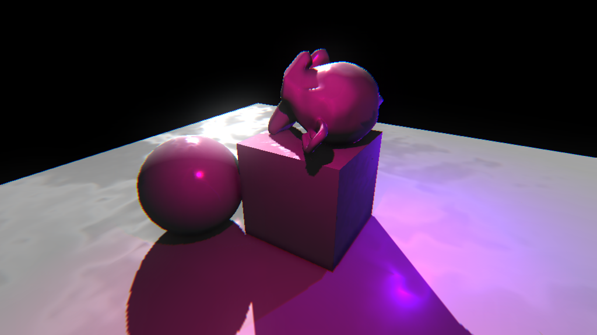

# X
A collection of useful scripts/shaders/objects for GameMaker Studio 2.

Maintained by: [kraifpatrik](https://github.com/kraifpatrik)
Donate: [PayPal.Me](https://www.paypal.me/kraifpatrik/1usd)

# Latest Screenshot

# Table of Contents
- [Reference](#reference) 
<REFERENCE_TOC>

# Reference
<REFERENCE>
